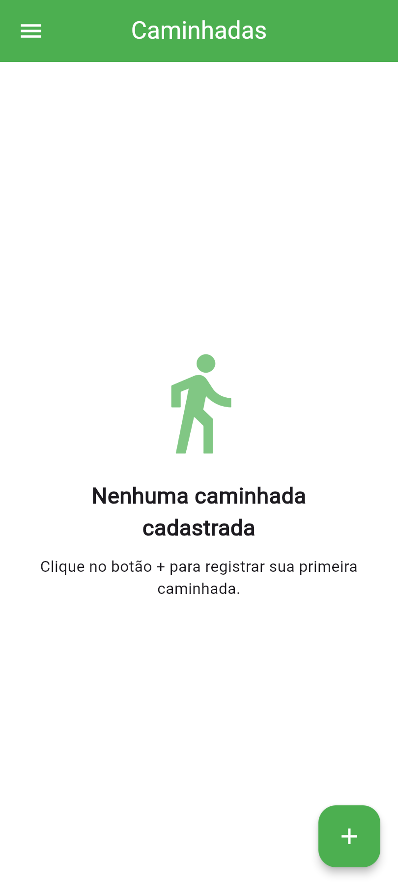
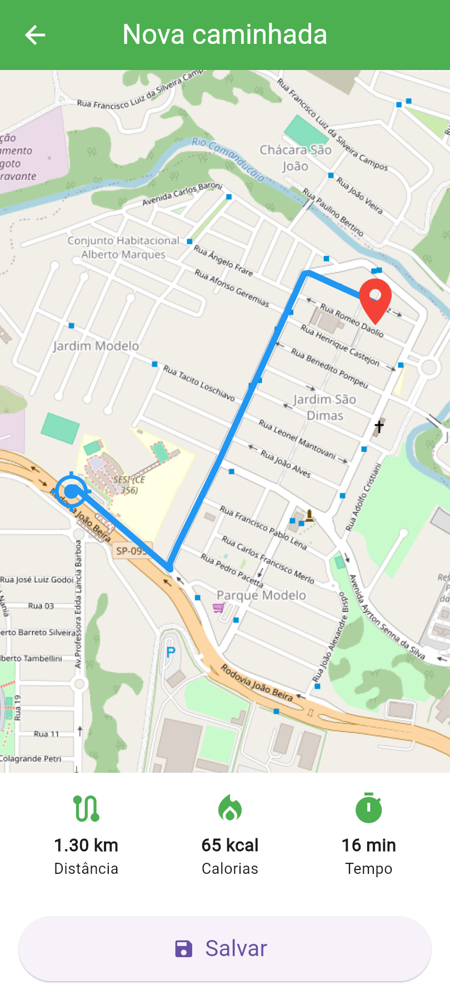
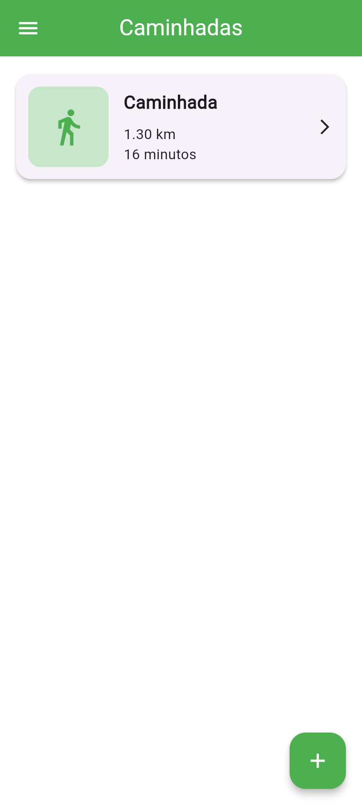
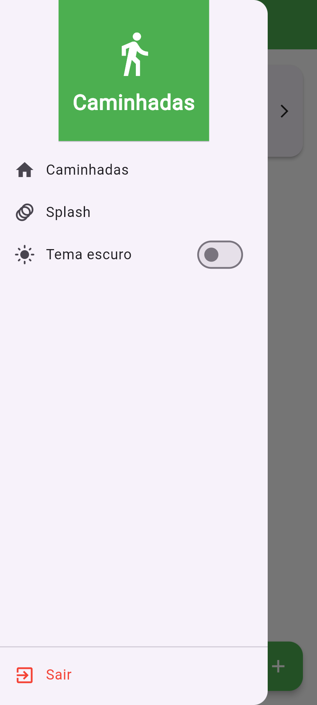

# flutter_app_caminhada

# 🗺️ Flutter Caminhadas

Aplicativo desenvolvido em Flutter com integração de mapas para caminhadas com distância, calorias perdidas e o tempo.

📱 Prints

<table>
<tr>
<td></td>
<td></td>
</tr>
<tr>
<td></td>
<td></td>
</tr>
</table>

## 🛠️ Tecnologias

- Flutter
- Dart
- Flutter Maps
- VsCode

## 🚀 Funcionalidades

- Visualização do mapa
- Distancia para percorrer
- Marcadores de localização
- Calorias perdidas
- Tempo demorado para percorrer